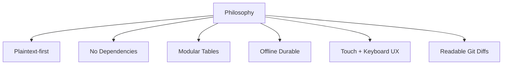
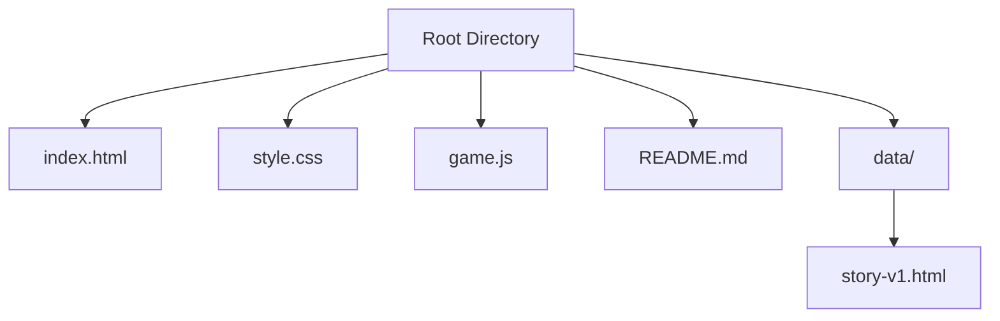
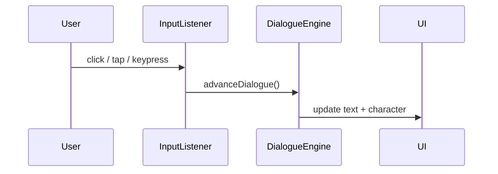
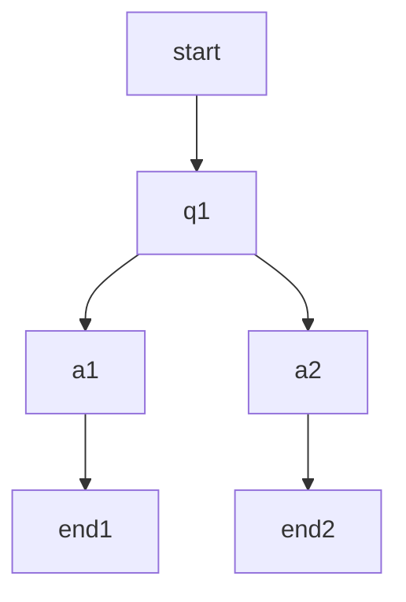
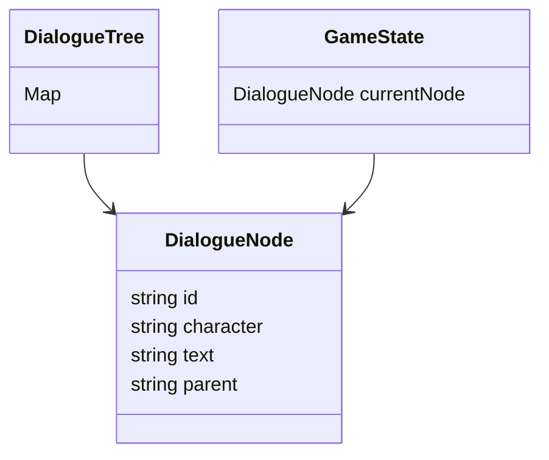

# Wanderer's Journey

> “I have walked this path before… but never like this.”


Wanderer's Journey is a zero-dependency, text-based, side-scrolling narrative engine. It’s built for creators who prefer plaintext over pixels, structure over spectacle, and clarity over cleverness.

This project isn’t just a game — it’s a framework for walking through stories, authored in simple HTML tables, rendered in the browser, and driven by keyboard, mouse, or touch.

## Table of Contents

- [Getting Started](#getting-started)
- [Project Goals](#project-goals)
- [Design Philosophy](#design-philosophy)
- [Folder Structure](#folder-structure)
- [Dialogue System](#dialogue-system)
- [Game Engine](#game-engine)
- [UI and Rendering](#ui-and-rendering)
- [Effort Breakdown](#effort-breakdown)
- [Mermaid Diagrams](#mermaid-diagrams)
- [Roadmap](#roadmap)
- [Contributing](#contributing)
- [License](#license)

## Getting Started

No build tools. No installs. Just open index.html in a browser.

git clone https://github.com/yourname/wanderers-journey.git
cd wanderers-journey
open index.html  # or drag into browser

You’ll see a wanderer. And a voice. And a question.

## Project Goals

This project was created to explore:

Narrative through movement — simple inputs, layered meaning

Dialogues as data — editable, versionable, inspectable

Text-first interaction — like a visual novel with no interface clutter

World-building without world-building tools — just files and flow

## Design Philosophy

Plaintext first: Tables are the source of truth

Portable by default: Works offline, no install

Inspectable & editable: HTML + JS + CSS only

Stable evolution: Easy to add chapters, tags, flags

Boring tech: Prefer the idiomatic and tested





## Folder Structure

> Every file matters. Each one does exactly one thing.




```html
<!-- index.html -->

<main>
  <section id="dialogue-ui">
    <h2 id="character-name"></h2>
    <blockquote id="dialogue-text">Tap to begin...</blockquote>
  </section>

  <table id="dialogue-table" style="display:none;">
    <thead><tr><th>id</th><th>character</th><th>text</th><th>parent</th></tr></thead>
    <tbody>
      <tr><td>start</td><td>Wanderer</td><td>The journey begins.</td><td></td></tr>
    </tbody>
  </table>
</main>
```

```css
/* style.css */

#dialogue-ui {
  max-width: 500px;
  background: white;
  padding: 1em;
  border-radius: 10px;
  box-shadow: 0 0 10px #888;
}
```

```js
// game.js

function parseTableToObjects(tableId) { /* ... */ }
const DialogueManager = (() => { /* ... */ })();
window.addEventListener('DOMContentLoaded', DialogueManager.init);
```

## Dialogue System

Authoring Format

```html
<tr><td>start</td><td>Wanderer</td><td>The forest whispers.</td><td></td></tr>
<tr><td>q1</td><td>Fox</td><td>Do you listen?</td><td>start</td></tr>
```

Data Flow

```mermaid
flowchart TD
  A[HTML <table>] --> B[parseTable()]
  B --> C[Array of Dialogue Rows]
  C --> D[buildDialogueTree()]
  D --> E[Tree: parent → children[]]
```

### Dialogue Node Structure

Each dialogue node consists of the following fields:

- **id**: Unique identifier for the node.
- **character**: The character speaking.
- **text**: The dialogue text.
- **parent**: The ID of the parent node (where the dialogue originated).

### Features

- **Branching**: Create multiple dialogue paths.
- **Conditional Logic**: (Planned) Add conditions to control dialogue flow.
- **Export Logs**: (Planned) Save and review playthrough logs.

## Game Engine

### Input & Loop



### Example Tree



## UI and Rendering

### Basic DOM

- `<blockquote>` for dialogue

- `<h2>` for character name

```css
/* CSS for spacing and mobile UX */
```

### Runtime Logic

```javascript
function showNode(id) {
  const node = findById(id);
  nameEl.textContent = node.character;
  textEl.textContent = node.text;
}
```

### Future Upgrades

- Dialogue choices
- Avatars / portraits
- Sound effects or audio reading


## Effort Breakdown

🟦 30% - Dialogue parsing & engine logic
🟩 20% - Dialogue table authoring & structure
🟨 30% - UI & rendering layer
🟧 10% - World modeling
🟪 10% - CSS & visual polish


## Mermaid Diagrams

<!-- This README includes:

graph TD for folder and tree views

flowchart TD for data pipelines

sequenceDiagram for input → UI loops

classDiagram for JS structure

gantt for roadmap -->





## Roadmap

```
gantt
  title Wanderer's Journey Roadmap
  dateFormat  YYYY-MM-DD
  section Core
  Parsing & State Engine :done, core1, 2024-06-01, 4d
  UI Rendering           :done, core2, 2024-06-05, 3d
  section Interaction
  Dialogue Choices       :active, int1, 2024-06-08, 3d
  Export Logs            :planned, int2, 2024-06-11, 2d
  Map Navigation         :planned, int3, 2024-06-13, 4d
```


## Contributing

Pull requests welcome. Ideas welcome. Keep it minimal.

Add test dialogue trees

Add new example characters or fables

Submit CSS themes (but keep it simple)

Avoid adding libraries unless absolutely necessary

## License

MIT. This is a tool for people who want to write stories in tables.
